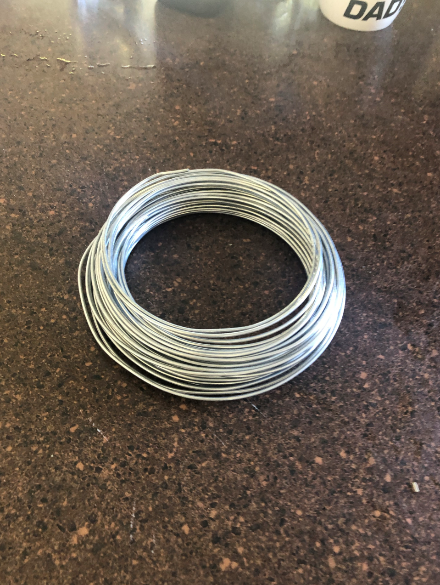

# 1701QCA Making Interaction - Assessment 3 workbook

## Project working title ##
*A floor cleaning and drying robot with Mecanum Wheels*

## Related projects ##

### Related project 1 ###
*Arduino Mecanum Wheels Robot*

*https://www.youtube.com/watch?v=83tVkgT89dM*

This project is related to mine because *I think the wheels in this project can increase the fun of the robots in my project.*.

### Related project 2 ###
*SparkFun Mecanum Wheels*

*https://www.youtube.com/watch?v=O7FbDy-gE70*

This project is related to mine because *I did more research on wheels that can rotate 360 degrees to see if they can be used in my project.*.

### Related project 3 ###
*Remote Control Lawn Mower Robot*

*https://www.youtube.com/watch?v=Lb17YiUi43A*

This project is related to mine because *this is an interesting feature.*.

### Related project 4 ###
*An Automatic Floor Cleaning Robot*

*https://www.youtube.com/watch?v=0_-bF3OlHCI*

This project is related to mine because *as a housewife, I hope my robot can help me do more. This simple mopping robot provides me with a good direction.*.

### Related project 5 ###
*Vacuuming Robot*

*https://www.youtube.com/watch?v=R4Qe1n-1uWg*

This project is related to mine because *this homemade vacuum cleaner is very interesting. This gives my project more inspiration, and I can consider setting more functions for the robot.*.

### Related project 6 ###
*Floor Cleaning Machine*

*https://www.youtube.com/watch?v=_mMsg4ikuIA*

This project is related to mine because *the difference with the fourth project is that this is simpler and the materials are more daily. But the device in front of it is more complicated and provides me with a good reference.*.

### Related project 7 ###
*Remote Controlled Floor Cleaning Robot*

*https://www.youtube.com/watch?v=FpNmaW3-AcE*

After seeing this project, I think my project can also use a small motor to control the rag to rotate, which gave me great inspiration.*.

## Other research ##

### *CleanSweep: The Floor Cleaning Robot* ###

*https://www.youtube.com/watch?v=B92vy_2ewfg

In this project, the rotating mop at the front of the robot and the foam roller at the rear can complete the work well. There is also a water pump and water reservoir that can be opened when needed to sprinkle water on the floor and moisten the mop for proper cleaning. The foam roller is movable, which means that you can lift the foam roller when not in use. In addition, speed control is added to the drive motor in this robot. This project is still a bit complicated for me, but I am more clear about how my robot should be done.*

### * Make a floor cleaning machine* ###

*https://www.youtube.com/watch?v=05sZnyV6utM

I think what attracted me the most about this project was that it looked more interesting and less like a floor mopping robot, breaking my stereotype of conventional robots.*

### *FLOOR MOPPING Robot* ###

*https://www.youtube.com/watch?v=ZnFSaMD7_pM

This project gave me a different experience. The cleaning tools used by sweeping robots are not the only ones. They can be diverse and can be obtained locally. And the 3D printer and laser cut he used are very useful tools, although very troublesome.*

## Conceptual progress ##

### Design intent ###
*A floor cleaning robot with Mecanum Wheels*

### Design concept 1 ###
*Design concept 1:A board with a rag is installed in front of the robot. When the robot is moved by remote control, the rag will start to work and wipe the floor.* 

### Design concept 2 ###
*Design concept 2: When the robot is equipped with Mecanum Wheels, it can rotate 360, not just forward or backward.*

### Final design concept ###
*I can install a wet rag on the front and a dry rag on the back for easier cleaning.
The bolder idea is to transform the rag into a rotatable one. I do n’t know if it can be achieved later.*

### Interaction flowchart ###
*Draw a draft flowchart of what you anticipate the interaction process in your project to be. Make sure you think about all the stages of interaction step-by-step. Also make sure that you consider actions a user might take that aren't what you intend in an ideal use case. Insert an image of it below. It might just be a photo of a hand-drawn sketch, not a carefully drawn digital diagram. It just needs to be legible.*

## Physical experimentation documentation ##

*In this section, show your progress including whichever of the following are appropriate for your project at this point.
a.	Technical development. Could be code screenshots, pictures of electronics and hardware testing, video of tests. 
b.	Fabrication. Physical models, rough prototypes, sketches, diagrams of form, material considerations, mood boards, etc.
Ensure you include comments about the choices you've made along the way.*

*You will probably have a range of images and screenshots. Any test videos should be uploaded to YouTube or other publicly accessible site and a link provided here.*

Draft

*Draft for Assessment02*

*Draft for Assessment03*

Code Screenshots

Development

Materials

Youtube Video

https://youtu.be/ZwFAxUPYgks

## Design process discussion ##
*In this session, I mainly upgraded the materials used by this robot to make this robot look more stable. I also replaced the two cleaning tools on the front and back of the robot with more functional tools. In the process of making, I realized that learning this course is not just learning programming, but also the patience and care in the process. Especially in such a special period, it is very difficult to calm down and slowly say that this robot is doing well. No matter what the result is, I have done it.*

